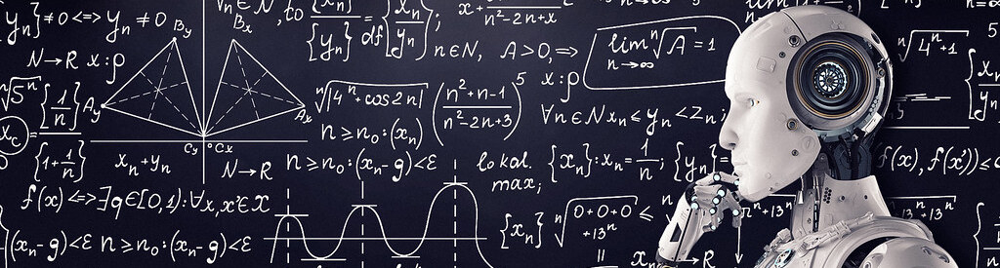

---
# Feel free to add content and custom Front Matter to this file.
# To modify the layout, see https://jekyllrb.com/docs/themes/#overriding-theme-defaults

permalink: /
title: Home
layout: seasons
season: winter2026
---

The [Robotics and Embodied AI Lab](https://montrealrobotics.ca/) and [Mila](https://mila.quebec/en/) are hosting the Winter 2026 edition of the Mila Robot Learning Seminar; a set of virtual talks by researchers in this field. Seminars usually take place at 11:00 Eastern time on Thursdays and are streamed on [our YouTube channel](https://www.youtube.com/channel/UCOouaBg4gHIlNvPkJn_8ooA).

We have an exciting lineup of speakers for this newest edition of the seminar series! Follow us [on Twitter](https://twitter.com/MontrealRobots) for more updates.

<!-- # TODO: Add Calendar
# **Calendar**: Our schedule is also available as a Google calendar [here](https://calendar.google.com/calendar/u/0?cid=MWgyMnV2b284dWF0cW5nbGQ4ZXZxZThuc3NAZ3JvdXAuY2FsZW5kYXIuZ29vZ2xlLmNvbQ). -->
